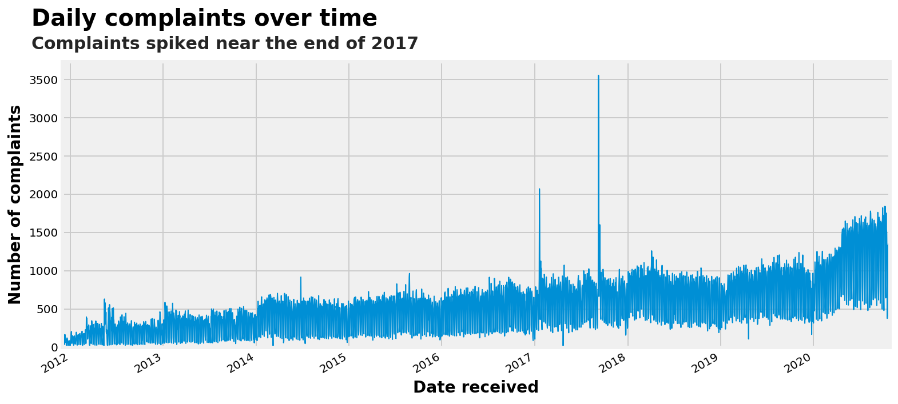
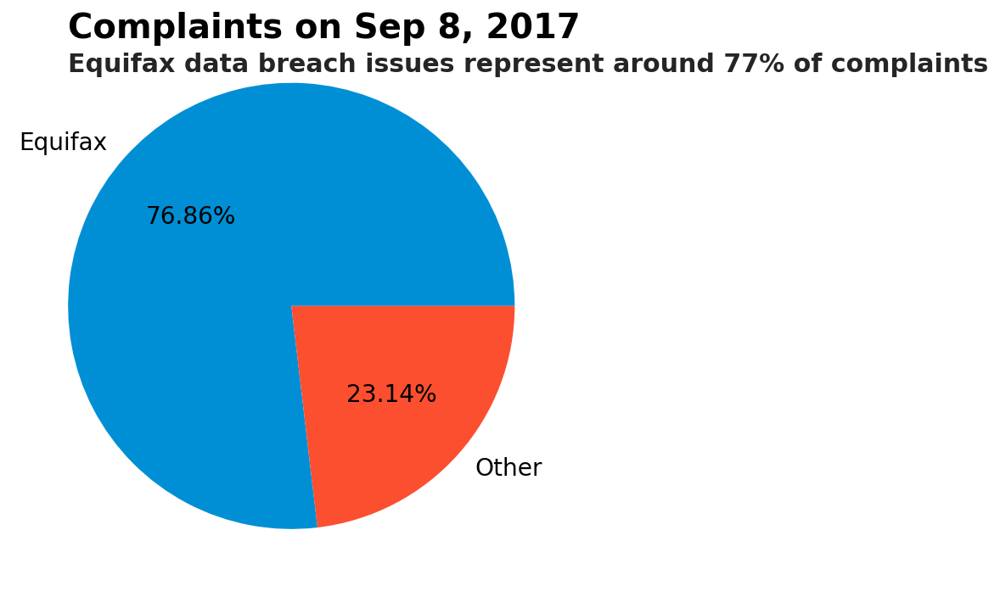
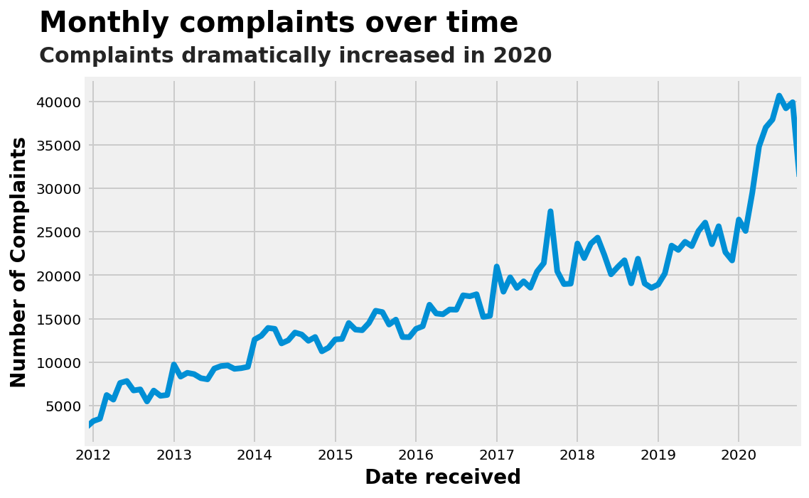
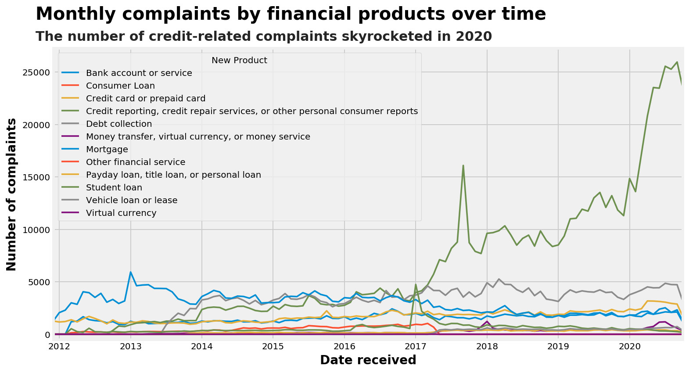
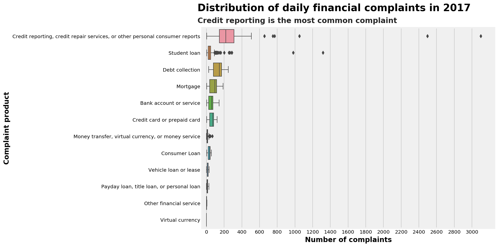
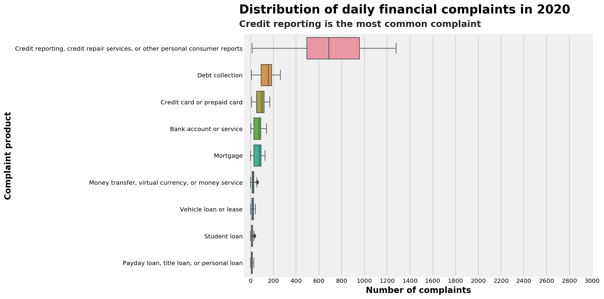
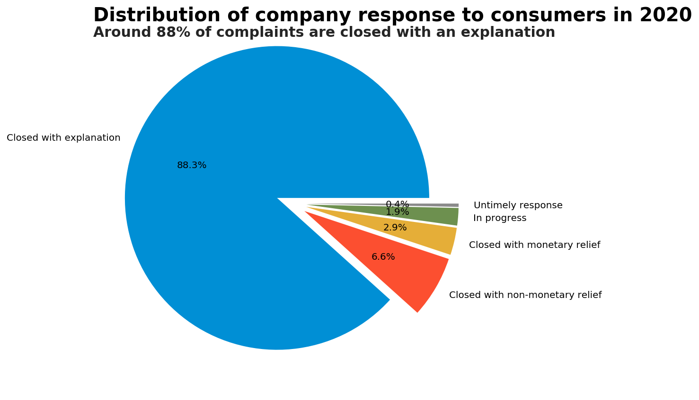

# CFPB - Complaints Database

<iframe id="igraph" scrolling="no" style="border:none;" seamless="seamless" src="https://plotly.com/~dz777/1.embed" height="525" width="100%"></iframe>


The [Consumer Financial Protection Bureau](https://www.consumerfinance.gov) (CFPB) was created through the Dodd-Frank Act as a response to questionable practices in the lending and investment industries leading up to the 2008 financial crisis and the Great Recession. The financial crisis led to new regulations of financial services companies. The CFPB is tasked with enforcing federal regulations on financial institutions and aims to help consumers better understand the details, costs, and risks of financial products <cite>[(*Forbes*)][1]</cite>.

[1]: https://www.forbes.com/advisor/personal-finance/the-cfpb-protecting-and-educating-financial-consumers/

The CFPB's mandate is to make sure consumers are treated faily by financial services firms, banks, credit card issuers, mortgage companies, and the like. One of the ways that the CFPB helps protect consumers’ rights is by taking consumer complaints and investigating them. The agency keeps a central consumer complaint database with records of complaints by consumers against financial services companies. The CFPB contacts each company that is subject to a complaint and requires them to respond to each one. Although the agency expects companies to resolve complaints within 60 days, most companies will repond within 15 days. Data from those complaints helps the CFPB understand the financial marketplace and protect consumers.

To submit a complaint to the CFPB, visit: https://www.consumerfinance.gov/complaint/


**Data Source**

This project examines and analyzes the Consumer Financial Protection Bureau's (CFPB) complaints database. 

The CFPB consumer complaint database was downloaded directly from the CFPB website [here](https://www.consumerfinance.gov/data-research/consumer-complaints/). In order to re-use the code from this project, download and unzip "complaints.csv" in the same folder as this Jupyter notebook code.

As described by the [CFPB](https://cfpb.github.io/api/ccdb/fields.html), the following fields are included in the database:

 - **Date received** -	The date the CFPB received the complaint
 - **Product** - The type of product the consumer identified in the complaint
 - **Sub-product** - The type of sub-product the consumer identified in the complaint
 - **Issue** - The issue the consumer identified in the complaint
 - **Sub-issue** -	The sub-issue the consumer identified in the complaint
 - **Consumer complaint narrative**	- Consumer complaint narrative is the consumer-submitted description of what happened from the complaint. Consumers must opt-in to share their narrative. The narrative will not be published unless the consumer consents and they can opt-out at any time.
 - **Company public response** - The company's optional, public-facing response to a consumer's complaint. Companies can choose to select a response from a pre-set list of options that will be posted on the public database. For example, "Company believes complaint is the result of an isolated error."
 - **Company** - The complaint is about this company. 
 - **State** -	The state of the mailing address provided by the consumer.
 - **ZIP code** -	The mailing ZIP code provided by the consumer.
 - **Tags** -	Data that supports easier searching and sorting of complaints submitted by or on behalf of consumers. Ex: "Older American," "Servicemember."
 - **Consumer consent provided?** - Identifies whether the consumer opted in to publish their complaint narrative. The CFPB does publish the narrative unless the consumer consents.
 - **Submitted via** -	How the complaint was submitted to the CFPB.
 - **Date sent to company** -	The date the CFPB sent the complaint to the company.
 - **Company response to consumer** -	This is how the company responded. For example, "Closed with explanation." 
 - **Timely response?** -	Whether the company gave a timely response.
 - **Consumer disputed?**	Whether the consumer disputed the company’s response. 
 - **Complaint ID**	- The unique identification number for a complaint.


# Data: importing and pre-processing

## Import packages


```python
## Importing packages

# Importing packages for data manipulation and cleaning
import pandas as pd
import numpy as np

# Importing packages for visualization
import seaborn as sns

import matplotlib.pyplot as plt

# Telling matplotlib to use 538 style for graphs
plt.style.use('fivethirtyeight')
## 2nd option plt.style.use('seaborn-whitegrid')

# Using plotly express for more ease (https://plotly.com/python/plotly-express/)
import plotly.express as px

# Using plotly graph objects for different graphs 
import plotly.graph_objects as go

# Telling matplotlib to use 'retina' display when ouputting graphs to make it sharper
%config InlineBackend.figure_format = 'retina'

# Making plot outputs appear
%matplotlib inline
```

## Load data 


```python
# Load the complaints data
complaints = pd.read_csv('complaints.csv')

# Show the first 5 rows
complaints.head()
```


<div>
<style scoped>
    .dataframe tbody tr th:only-of-type {
        vertical-align: middle;
    }

    .dataframe tbody tr th {
        vertical-align: top;
    }

    .dataframe thead th {
        text-align: right;
    }
</style>
<table border="1" class="dataframe">
  <thead>
    <tr style="text-align: right;">
      <th></th>
      <th>Date received</th>
      <th>Product</th>
      <th>Sub-product</th>
      <th>Issue</th>
      <th>Sub-issue</th>
      <th>Consumer complaint narrative</th>
      <th>Company public response</th>
      <th>Company</th>
      <th>State</th>
      <th>ZIP code</th>
      <th>Tags</th>
      <th>Consumer consent provided?</th>
      <th>Submitted via</th>
      <th>Date sent to company</th>
      <th>Company response to consumer</th>
      <th>Timely response?</th>
      <th>Consumer disputed?</th>
      <th>Complaint ID</th>
    </tr>
  </thead>
  <tbody>
    <tr>
      <th>0</th>
      <td>2019-09-24</td>
      <td>Debt collection</td>
      <td>I do not know</td>
      <td>Attempts to collect debt not owed</td>
      <td>Debt is not yours</td>
      <td>transworld systems inc. \nis trying to collect...</td>
      <td>NaN</td>
      <td>TRANSWORLD SYSTEMS INC</td>
      <td>FL</td>
      <td>335XX</td>
      <td>NaN</td>
      <td>Consent provided</td>
      <td>Web</td>
      <td>2019-09-24</td>
      <td>Closed with explanation</td>
      <td>Yes</td>
      <td>NaN</td>
      <td>3384392</td>
    </tr>
    <tr>
      <th>1</th>
      <td>2019-09-19</td>
      <td>Credit reporting, credit repair services, or o...</td>
      <td>Credit reporting</td>
      <td>Incorrect information on your report</td>
      <td>Information belongs to someone else</td>
      <td>NaN</td>
      <td>Company has responded to the consumer and the ...</td>
      <td>Experian Information Solutions Inc.</td>
      <td>PA</td>
      <td>15206</td>
      <td>NaN</td>
      <td>Consent not provided</td>
      <td>Web</td>
      <td>2019-09-20</td>
      <td>Closed with non-monetary relief</td>
      <td>Yes</td>
      <td>NaN</td>
      <td>3379500</td>
    </tr>
    <tr>
      <th>2</th>
      <td>2019-11-08</td>
      <td>Debt collection</td>
      <td>I do not know</td>
      <td>Communication tactics</td>
      <td>Frequent or repeated calls</td>
      <td>Over the past 2 weeks, I have been receiving e...</td>
      <td>NaN</td>
      <td>Diversified Consultants, Inc.</td>
      <td>NC</td>
      <td>275XX</td>
      <td>NaN</td>
      <td>Consent provided</td>
      <td>Web</td>
      <td>2019-11-08</td>
      <td>Closed with explanation</td>
      <td>Yes</td>
      <td>NaN</td>
      <td>3433198</td>
    </tr>
    <tr>
      <th>3</th>
      <td>2020-10-22</td>
      <td>Credit reporting, credit repair services, or o...</td>
      <td>Credit reporting</td>
      <td>Problem with a credit reporting company's inve...</td>
      <td>Their investigation did not fix an error on yo...</td>
      <td>NaN</td>
      <td>NaN</td>
      <td>EQUIFAX, INC.</td>
      <td>PA</td>
      <td>19132</td>
      <td>NaN</td>
      <td>NaN</td>
      <td>Web</td>
      <td>2020-10-22</td>
      <td>Closed with explanation</td>
      <td>Yes</td>
      <td>NaN</td>
      <td>3913806</td>
    </tr>
    <tr>
      <th>4</th>
      <td>2019-09-15</td>
      <td>Debt collection</td>
      <td>Other debt</td>
      <td>Attempts to collect debt not owed</td>
      <td>Debt was result of identity theft</td>
      <td>Pioneer has committed several federal violatio...</td>
      <td>NaN</td>
      <td>Pioneer Capital Solutions Inc</td>
      <td>CA</td>
      <td>925XX</td>
      <td>NaN</td>
      <td>Consent provided</td>
      <td>Web</td>
      <td>2019-09-15</td>
      <td>Closed with explanation</td>
      <td>Yes</td>
      <td>NaN</td>
      <td>3374555</td>
    </tr>
  </tbody>
</table>
</div>


```python
# Checking number of rows (~1.8 million) and columns (18)
complaints.shape
```


    (1815566, 18)


## Pre-processing


```python
# Changing the Date received column to datetime to use all the date features Pandas offers
complaints['Date received'] = pd.to_datetime(complaints['Date received'])
# Checking
complaints['Date received'].head()
```


    0   2019-09-24
    1   2019-09-19
    2   2019-11-08
    3   2020-10-22
    4   2019-09-15
    Name: Date received, dtype: datetime64[ns]


```python
# Count the number of record of complaints for each Product
complaints['Product'].value_counts()
```


    Credit reporting, credit repair services, or other personal consumer reports    537224
    Debt collection                                                                 318610
    Mortgage                                                                        313062
    Credit reporting                                                                140432
    Credit card or prepaid card                                                      92593
    Credit card                                                                      89190
    Bank account or service                                                          86206
    Checking or savings account                                                      75095
    Student loan                                                                     59571
    Consumer Loan                                                                    31604
    Vehicle loan or lease                                                            20526
    Money transfer, virtual currency, or money service                               20478
    Payday loan, title loan, or personal loan                                        15182
    Payday loan                                                                       5543
    Money transfers                                                                   5354
    Prepaid card                                                                      3819
    Other financial service                                                           1059
    Virtual currency                                                                    18
    Name: Product, dtype: int64


```python
# Creating a new column to then group the similar categories of Products together
complaints['New Product'] = complaints['Product']

# Locate the rows where Products are equal to credit reporting and in the column New Product
# change the values to Credit reporting, credit repair services, or other personal consumer reports
complaints.loc[complaints['Product']=='Credit reporting', 'New Product'] = 'Credit reporting, credit repair services, or other personal consumer reports'

# Do the same for the two separate credit card and prepaid card rows, change them to Credit card or prepaid card
# in the New Product column
complaints.loc[(complaints['Product']=='Credit card') | (complaints['Product']=='Prepaid card'), 'New Product'] = 'Credit card or prepaid card'

# Do the same for the money transfers row, change it to Money transfer, virtual currency, or money service
# in the New Product column
complaints.loc[complaints['Product']=='Money transfers', 'New Product'] = 'Money transfer, virtual currency, or money service'

# Do the same for the payday loan row, change it to Payday loan, title loan, or personal loan
# in the New Product column
complaints.loc[complaints['Product']=='Payday loan', 'New Product'] = 'Payday loan, title loan, or personal loan'

# Do the same for the Checking or savings account row, change it to Bank account or service  
# in the New Product column
complaints.loc[complaints['Product']=='Checking or savings account', 'New Product'] = 'Bank account or service'
```


```python
# Checking the New Product column
complaints['New Product'].value_counts()
```


    Credit reporting, credit repair services, or other personal consumer reports    677656
    Debt collection                                                                 318610
    Mortgage                                                                        313062
    Credit card or prepaid card                                                     185602
    Bank account or service                                                         161301
    Student loan                                                                     59571
    Consumer Loan                                                                    31604
    Money transfer, virtual currency, or money service                               25832
    Payday loan, title loan, or personal loan                                        20725
    Vehicle loan or lease                                                            20526
    Other financial service                                                           1059
    Virtual currency                                                                    18
    Name: New Product, dtype: int64


# Analysis and Visualizations

## Daily complaints over time


```python
# Daily number of complaints

# Create a variable daily, group first by Date received, count the Complaint IDs within each date, change to 
# table format and rename the Complaint ID column to Count
daily = complaints.groupby('Date received')['Complaint ID'].count().reset_index(name='Count')
# Checking
daily.head()
```


<div>
<style scoped>
    .dataframe tbody tr th:only-of-type {
        vertical-align: middle;
    }

    .dataframe tbody tr th {
        vertical-align: top;
    }

    .dataframe thead th {
        text-align: right;
    }
</style>
<table border="1" class="dataframe">
  <thead>
    <tr style="text-align: right;">
      <th></th>
      <th>Date received</th>
      <th>Count</th>
    </tr>
  </thead>
  <tbody>
    <tr>
      <th>0</th>
      <td>2011-12-01</td>
      <td>120</td>
    </tr>
    <tr>
      <th>1</th>
      <td>2011-12-02</td>
      <td>138</td>
    </tr>
    <tr>
      <th>2</th>
      <td>2011-12-03</td>
      <td>26</td>
    </tr>
    <tr>
      <th>3</th>
      <td>2011-12-04</td>
      <td>22</td>
    </tr>
    <tr>
      <th>4</th>
      <td>2011-12-05</td>
      <td>164</td>
    </tr>
  </tbody>
</table>
</div>


```python
# Making time series graph of daily complaints

# Creating plot, configuring the plot specifications inside the variables fig and ax
fig, ax = plt.subplots(figsize=(11,5))

# Plotting daily variable as a a line plot, set x,y, linewidth, and specifying ax
daily.plot(kind='line', x='Date received', y='Count', linewidth=1, ax=ax)

# Setting x,y label and size
ax.set_xlabel('Date received', fontsize=14, fontweight = 'bold')
ax.set_ylabel('Number of complaints', fontsize=14, fontweight = 'bold')

# Putting title and subtitle in specific x,y coordinates
# customizing font size, weight, and transparency
ax.text(734350, 4200, "Daily complaints over time", fontsize=20, fontweight="bold")
ax.text(734350, 3900, "Complaints spiked near the end of 2017", fontsize=15, fontweight="bold", alpha=0.85)

# Setting the bottom of y lim
ax.set_ylim(bottom=0)

# Remove count legend
ax.get_legend().remove()

# Take out matplotlib message
plt.tight_layout()

# saving image
plt.savefig('1timeseries_d_complaints.png')
```





```python
# checking what specific date that peak in the graph above refers to
max_count = daily['Count'].max()
daily[daily['Count'] == max_count]
```


<div>
<style scoped>
    .dataframe tbody tr th:only-of-type {
        vertical-align: middle;
    }

    .dataframe tbody tr th {
        vertical-align: top;
    }

    .dataframe thead th {
        text-align: right;
    }
</style>
<table border="1" class="dataframe">
  <thead>
    <tr style="text-align: right;">
      <th></th>
      <th>Date received</th>
      <th>Count</th>
    </tr>
  </thead>
  <tbody>
    <tr>
      <th>2107</th>
      <td>2017-09-08</td>
      <td>3553</td>
    </tr>
  </tbody>
</table>
</div>


## What's up with the spike? Equifax complaints


```python
# Create variable target_date for September 8, 2017 as Date received
target_date = complaints['Date received'] == '2017-09-08'

# Create a variable target_firm for mentions of equifax in the Company column
# set everything to lowercase when searching
target_firm = complaints['Company'].str.lower().str.contains('equifax')
```


```python
# Create a variable equifax_sept_8_df with any mention of equifax on Sept 8, 2017
# make copy for graph later
equifax_sept_8_df = complaints[target_date & target_firm].copy()

# Create a variable sept_8_df that contains all the complaints on Sept 8, 2017
# make copy for graph later
sept_8_df = complaints[target_date].copy()

# Finding the ratio of equifax complaints on Sept 8, 2017 over all Sept 8, 2017 complaints
ratio_equifax = len(equifax_sept_8_df)/len(sept_8_df)

# Transforming the ratio into percentage, rounding to two digits
round(100*ratio_equifax,2)
```


    76.86


```python
# Create a new column called Is Equifax, using Numpy's where function, 
# wherever the column Company in lowercase contains the word equifax, set the value of the new column
# to Equifax, otherwise set it to Other
# np.where(conditions, value if true, value if false)
sept_8_df['Is Equifax'] = np.where(sept_8_df['Company'].str.lower().str.contains('equifax'),
                                   'Equifax','Other')
# Checking                              
sept_8_df[['Is Equifax']].head()
```


<div>
<style scoped>
    .dataframe tbody tr th:only-of-type {
        vertical-align: middle;
    }

    .dataframe tbody tr th {
        vertical-align: top;
    }

    .dataframe thead th {
        text-align: right;
    }
</style>
<table border="1" class="dataframe">
  <thead>
    <tr style="text-align: right;">
      <th></th>
      <th>Is Equifax</th>
    </tr>
  </thead>
  <tbody>
    <tr>
      <th>585</th>
      <td>Other</td>
    </tr>
    <tr>
      <th>1646</th>
      <td>Other</td>
    </tr>
    <tr>
      <th>6761</th>
      <td>Other</td>
    </tr>
    <tr>
      <th>8339</th>
      <td>Equifax</td>
    </tr>
    <tr>
      <th>30001</th>
      <td>Equifax</td>
    </tr>
  </tbody>
</table>
</div>


```python
# Create a variable called equifax_issues, count the number of Complaint IDs by the group
# inside Is Equifax 
equifax_issues = sept_8_df.groupby(['Is Equifax'])['Complaint ID'].count()

# Checking
equifax_issues
```


    Is Equifax
    Equifax    2731
    Other       822
    Name: Complaint ID, dtype: int64


```python
# Creating plot of Equifax complaints ratio
# (https://pandas.pydata.org/pandas-docs/stable/reference/api/pandas.DataFrame.plot.pie.html)
# (https://pandas.pydata.org/pandas-docs/version/0.23.4/generated/pandas.DataFrame.plot.html)
# (https://stackoverflow.com/questions/21090316/plotting-pandas-dataframes-in-to-pie-charts-using-matplotlib)

# Creating pie plot, configuring specifications, showing the percent to the 2nd decimal
fig, ax = plt.subplots(figsize=(8,5))
equifax_issues.plot(kind='pie', ax=ax, fontsize=14, autopct='%.2f%%')

# Putting title and subtitle in specific x,y coordinates
# customizing font size, weight, and transparency
ax.text(-1,1.2, "Complaints on Sep 8, 2017", fontsize=20, fontweight="bold")
ax.text(-1,1.05, "Equifax data breach issues represent around 77% of complaints", fontsize=15, fontweight="bold", alpha=0.85)

# Getting rid of Complaint ID label
ax.set_ylabel('')

# Take out matplotlib message
plt.tight_layout()

# saving image
plt.savefig('2sept8_2017complaints_ratio.png')
```





As expected, the spike in complaints on September 8, 2017 was mainly due to Equifax, which represented around 77% of complaints.

## Monthly complaints over time


```python
# Monthly number of complaints

# first set the column Date received as the index
daily.index = daily['Date received']

# then use Panda's resample ('m') function to group the column Date received by month
# use sum to aggregate the daily counts to get the monthly number of complaints
# (https://chrisalbon.com/python/data_wrangling/pandas_group_data_by_time/)
monthly = daily.resample('m').sum()
```


```python
# Making time series graph of monthly complaints

# Creating plot, specifying its configurations
fig, ax = plt.subplots(figsize=(8,5))
monthly.plot(ax=ax,legend=False)

# Setting x,y label, size, and bold
ax.set_xlabel("Date received", fontsize=14, fontweight = 'bold')
ax.set_ylabel('Number of Complaints', fontsize=14, fontweight = 'bold')

# Putting title and subtitle in specific x,y coordinates
# customizing font size, weight, and transparency
ax.text(496, 48000, "Monthly complaints over time", fontsize=20, fontweight="bold")
ax.text(496, 44500, "Complaints dramatically increased in 2020", fontsize=15, fontweight="bold", alpha=0.85)

# Take out matplotlib message
plt.tight_layout()

# saving image
plt.savefig('3timeseries_m_complaints.png')
```





There is a huge spike in 2020 but what contributed to that? Let's check the product to see an explanation. 

## Complaints by product


```python
# Counting the number of Complaint ID for the pair Date received and New Product

# Creating a new variable daily_df, group by Date received and New Product, count the Complaint IDs, change to 
# table format and then rename the Complaint ID Column to Count
daily_df = complaints.groupby(['Date received', 'New Product'])['Complaint ID'].count().reset_index(name='Count')

# Checking the first 5 rows
daily_df.head()
```


<div>
<style scoped>
    .dataframe tbody tr th:only-of-type {
        vertical-align: middle;
    }

    .dataframe tbody tr th {
        vertical-align: top;
    }

    .dataframe thead th {
        text-align: right;
    }
</style>
<table border="1" class="dataframe">
  <thead>
    <tr style="text-align: right;">
      <th></th>
      <th>Date received</th>
      <th>New Product</th>
      <th>Count</th>
    </tr>
  </thead>
  <tbody>
    <tr>
      <th>0</th>
      <td>2011-12-01</td>
      <td>Credit card or prepaid card</td>
      <td>87</td>
    </tr>
    <tr>
      <th>1</th>
      <td>2011-12-01</td>
      <td>Mortgage</td>
      <td>33</td>
    </tr>
    <tr>
      <th>2</th>
      <td>2011-12-02</td>
      <td>Credit card or prepaid card</td>
      <td>110</td>
    </tr>
    <tr>
      <th>3</th>
      <td>2011-12-02</td>
      <td>Mortgage</td>
      <td>28</td>
    </tr>
    <tr>
      <th>4</th>
      <td>2011-12-03</td>
      <td>Credit card or prepaid card</td>
      <td>20</td>
    </tr>
  </tbody>
</table>
</div>


```python
# Making the New Product values become columns

# Use Panda's pivot function to transform the daily_df variable, putting Date received 
# as the index (row names) for aggregation and plotting later, specifying New Product 
# as the pivoted column, fill values with the Count
daily_df_wide = pd.pivot(daily_df, index='Date received', columns='New Product', values='Count')
# Checking
daily_df_wide.head()
```


<div>
<style scoped>
    .dataframe tbody tr th:only-of-type {
        vertical-align: middle;
    }

    .dataframe tbody tr th {
        vertical-align: top;
    }

    .dataframe thead th {
        text-align: right;
    }
</style>
<table border="1" class="dataframe">
  <thead>
    <tr style="text-align: right;">
      <th>New Product</th>
      <th>Bank account or service</th>
      <th>Consumer Loan</th>
      <th>Credit card or prepaid card</th>
      <th>Credit reporting, credit repair services, or other personal consumer reports</th>
      <th>Debt collection</th>
      <th>Money transfer, virtual currency, or money service</th>
      <th>Mortgage</th>
      <th>Other financial service</th>
      <th>Payday loan, title loan, or personal loan</th>
      <th>Student loan</th>
      <th>Vehicle loan or lease</th>
      <th>Virtual currency</th>
    </tr>
    <tr>
      <th>Date received</th>
      <th></th>
      <th></th>
      <th></th>
      <th></th>
      <th></th>
      <th></th>
      <th></th>
      <th></th>
      <th></th>
      <th></th>
      <th></th>
      <th></th>
    </tr>
  </thead>
  <tbody>
    <tr>
      <th>2011-12-01</th>
      <td>NaN</td>
      <td>NaN</td>
      <td>87.0</td>
      <td>NaN</td>
      <td>NaN</td>
      <td>NaN</td>
      <td>33.0</td>
      <td>NaN</td>
      <td>NaN</td>
      <td>NaN</td>
      <td>NaN</td>
      <td>NaN</td>
    </tr>
    <tr>
      <th>2011-12-02</th>
      <td>NaN</td>
      <td>NaN</td>
      <td>110.0</td>
      <td>NaN</td>
      <td>NaN</td>
      <td>NaN</td>
      <td>28.0</td>
      <td>NaN</td>
      <td>NaN</td>
      <td>NaN</td>
      <td>NaN</td>
      <td>NaN</td>
    </tr>
    <tr>
      <th>2011-12-03</th>
      <td>NaN</td>
      <td>NaN</td>
      <td>20.0</td>
      <td>NaN</td>
      <td>NaN</td>
      <td>NaN</td>
      <td>6.0</td>
      <td>NaN</td>
      <td>NaN</td>
      <td>NaN</td>
      <td>NaN</td>
      <td>NaN</td>
    </tr>
    <tr>
      <th>2011-12-04</th>
      <td>NaN</td>
      <td>NaN</td>
      <td>14.0</td>
      <td>NaN</td>
      <td>NaN</td>
      <td>NaN</td>
      <td>8.0</td>
      <td>NaN</td>
      <td>NaN</td>
      <td>NaN</td>
      <td>NaN</td>
      <td>NaN</td>
    </tr>
    <tr>
      <th>2011-12-05</th>
      <td>NaN</td>
      <td>NaN</td>
      <td>141.0</td>
      <td>NaN</td>
      <td>NaN</td>
      <td>NaN</td>
      <td>23.0</td>
      <td>NaN</td>
      <td>NaN</td>
      <td>NaN</td>
      <td>NaN</td>
      <td>NaN</td>
    </tr>
  </tbody>
</table>
</div>


```python
# Using Panda's resample ('m') function to group the row Date received by month, 
# use sum to aggregate the daily counts values to get the monthly number of complaints
monthly_df = daily_df_wide.resample('m').sum()
# Checking
monthly_df.head()
```


<div>
<style scoped>
    .dataframe tbody tr th:only-of-type {
        vertical-align: middle;
    }

    .dataframe tbody tr th {
        vertical-align: top;
    }

    .dataframe thead th {
        text-align: right;
    }
</style>
<table border="1" class="dataframe">
  <thead>
    <tr style="text-align: right;">
      <th>New Product</th>
      <th>Bank account or service</th>
      <th>Consumer Loan</th>
      <th>Credit card or prepaid card</th>
      <th>Credit reporting, credit repair services, or other personal consumer reports</th>
      <th>Debt collection</th>
      <th>Money transfer, virtual currency, or money service</th>
      <th>Mortgage</th>
      <th>Other financial service</th>
      <th>Payday loan, title loan, or personal loan</th>
      <th>Student loan</th>
      <th>Vehicle loan or lease</th>
      <th>Virtual currency</th>
    </tr>
    <tr>
      <th>Date received</th>
      <th></th>
      <th></th>
      <th></th>
      <th></th>
      <th></th>
      <th></th>
      <th></th>
      <th></th>
      <th></th>
      <th></th>
      <th></th>
      <th></th>
    </tr>
  </thead>
  <tbody>
    <tr>
      <th>2011-12-31</th>
      <td>0.0</td>
      <td>0.0</td>
      <td>1260.0</td>
      <td>0.0</td>
      <td>0.0</td>
      <td>0.0</td>
      <td>1276.0</td>
      <td>0.0</td>
      <td>0.0</td>
      <td>0.0</td>
      <td>0.0</td>
      <td>0.0</td>
    </tr>
    <tr>
      <th>2012-01-31</th>
      <td>0.0</td>
      <td>0.0</td>
      <td>1167.0</td>
      <td>0.0</td>
      <td>0.0</td>
      <td>0.0</td>
      <td>2063.0</td>
      <td>0.0</td>
      <td>0.0</td>
      <td>0.0</td>
      <td>0.0</td>
      <td>0.0</td>
    </tr>
    <tr>
      <th>2012-02-29</th>
      <td>0.0</td>
      <td>0.0</td>
      <td>1212.0</td>
      <td>0.0</td>
      <td>0.0</td>
      <td>0.0</td>
      <td>2297.0</td>
      <td>0.0</td>
      <td>0.0</td>
      <td>0.0</td>
      <td>0.0</td>
      <td>0.0</td>
    </tr>
    <tr>
      <th>2012-03-31</th>
      <td>1191.0</td>
      <td>141.0</td>
      <td>1378.0</td>
      <td>0.0</td>
      <td>0.0</td>
      <td>0.0</td>
      <td>2996.0</td>
      <td>0.0</td>
      <td>0.0</td>
      <td>524.0</td>
      <td>0.0</td>
      <td>0.0</td>
    </tr>
    <tr>
      <th>2012-04-30</th>
      <td>1256.0</td>
      <td>173.0</td>
      <td>1173.0</td>
      <td>0.0</td>
      <td>0.0</td>
      <td>0.0</td>
      <td>2852.0</td>
      <td>0.0</td>
      <td>0.0</td>
      <td>249.0</td>
      <td>0.0</td>
      <td>0.0</td>
    </tr>
  </tbody>
</table>
</div>


```python
#  Making graph of monthly New Product complaints over time

# Creating an empty canvas for the plot, specifying plot size
fig, ax = plt.subplots(figsize=(11,6))
# Put the plot of monthly_df in the canvas
monthly_df.plot(linewidth = 1.8, ax=ax)

# Setting x,y label, its size and making bold
ax.set_xlabel("Date received", fontsize=14, fontweight = 'bold')
ax.set_ylabel("Number of complaints", fontsize=14, fontweight = 'bold')

# Putting title and subtitle in specific x,y coordinates
# customizing font size, weight, and transparency
ax.text(500, 30000, "Monthly complaints by financial products over time", fontsize=20, fontweight="bold")
ax.text(500, 28000, "The number of credit-related complaints skyrocketed in 2020", fontsize=15, fontweight="bold", alpha=0.85)

# Setting the bottom of y lim
ax.set_ylim(bottom=-500)

# Removing matplot lib message
plt.tight_layout()

# saving image
plt.savefig('4timeseries_m_complaints_product.png')
```





The graph show clear spikes in 2017 and 2020 - due to the increase in complaints to the credit reporting, credit repair services, or other personal consumer reports. The graph makes it slightly difficult to see the other financial complaints by product, so let's check their distribution. Due to their spikes, let's compare 2017 to 2020. 

## Daily complaints by product - 2017 vs. 2020


```python
# creating variable by_product_by_day that has the complaints from the year 2017 [dt.year == 2017]
# or the complaints from 2020, group them by New Product and Date Received,
# count Complaint IDs, change to table format and rename the Complaint ID column to Count
# and sort by Count in descending order
by_product_by_day = (complaints[(complaints['Date received'].dt.year == 2017) | (complaints['Date received'].dt.year == 2020)]
                        .groupby(['New Product', 'Date received'])['Complaint ID']
                        .count().reset_index(name='Count')
                        .sort_values(by=['Count'], ascending=False)
                    )
# Creating a column named Year using Panda's dt.year to extract the year from the 
# Date received column
by_product_by_day['year'] = by_product_by_day['Date received'].dt.year
# Checking
by_product_by_day.head()
```


<div>
<style scoped>
    .dataframe tbody tr th:only-of-type {
        vertical-align: middle;
    }

    .dataframe tbody tr th {
        vertical-align: top;
    }

    .dataframe thead th {
        text-align: right;
    }
</style>
<table border="1" class="dataframe">
  <thead>
    <tr style="text-align: right;">
      <th></th>
      <th>New Product</th>
      <th>Date received</th>
      <th>Count</th>
      <th>year</th>
    </tr>
  </thead>
  <tbody>
    <tr>
      <th>1690</th>
      <td>Credit reporting, credit repair services, or o...</td>
      <td>2017-09-08</td>
      <td>3101</td>
      <td>2017</td>
    </tr>
    <tr>
      <th>1691</th>
      <td>Credit reporting, credit repair services, or o...</td>
      <td>2017-09-09</td>
      <td>2498</td>
      <td>2017</td>
    </tr>
    <tr>
      <th>4835</th>
      <td>Student loan</td>
      <td>2017-01-19</td>
      <td>1318</td>
      <td>2017</td>
    </tr>
    <tr>
      <th>2085</th>
      <td>Credit reporting, credit repair services, or o...</td>
      <td>2020-10-07</td>
      <td>1279</td>
      <td>2020</td>
    </tr>
    <tr>
      <th>2091</th>
      <td>Credit reporting, credit repair services, or o...</td>
      <td>2020-10-13</td>
      <td>1245</td>
      <td>2020</td>
    </tr>
  </tbody>
</table>
</div>


```python
# Creating seaborn boxplot of the distribution of daily complaints for comparison

# (https://seaborn.pydata.org/generated/seaborn.boxplot.html)
# Creating the boxplot of by_product_by_day df, configuring size, year, x and y values, linewidth 
fig, ax = plt.subplots(figsize=(14,7))
g = sns.boxplot(data=by_product_by_day[by_product_by_day['year']==2017], y='New Product', x='Count', ax=ax, linewidth = 1)

# Putting title and subtitle in specific x,y coordinates
# customizing font size, weight, and transparency
g.text(-100, -1.5, "Distribution of daily financial complaints in 2017", fontsize=20, fontweight='bold')
g.text(-100, -0.8, "Credit reporting is the most common complaint", fontsize=15, fontweight='bold', alpha=0.85)

# Setting x,y label, its size and making bold
g.set_xlabel('Number of complaints', fontsize=14, fontweight = 'bold')
g.set_ylabel('Complaint product', fontsize=14, fontweight= 'bold')

# setting the x ticks range from 0 to 3200 by increments of 200
g.set_xticks(np.arange(0, 3200, 200))

# Setting the bottom of x lim
g.set_xlim(left=-50)

# Removing matplot lib message
plt.tight_layout()

# saving image
plt.savefig('5distribution2017_d_complaints_product.png')
```





In 2017, the median number of credit reporting and related issues is a little over 200 daily complaints. However, there are outliers in the daily number of complaints, with the max reaching over 3,000 daily number of credit reporting and related issues complaints. Interestingly, student loans had a significant number of outliers and a small median.


```python
# Creating the boxplot of by_product_by_day, configuring size, year, x and y values, linewidth 
fig, ax = plt.subplots(figsize=(14,7))
g = sns.boxplot(data=by_product_by_day[by_product_by_day['year']==2020], y='New Product', x='Count', ax=ax, linewidth = 1)

# Putting title and subtitle in specific x,y coordinates
# customizing font size, weight, and transparency
g.text(-100, -1.3, "Distribution of daily financial complaints in 2020", fontsize=20, fontweight='bold')
g.text(-100, -0.8, "Credit reporting is the most common complaint", fontsize=15, fontweight='bold', alpha=0.85)

# Setting x,y label and size
g.set_xlabel('Number of complaints', fontsize=14, fontweight= 'bold')
g.set_ylabel('Complaint product', fontsize=14, fontweight= 'bold')

# Set the x ticks range from 0 to 3200 by increments of 200
g.set_xticks(np.arange(0, 3200, 200))

# Setting the bottom of x lim
g.set_xlim(left=-50)

# Removing matplot lib message
plt.tight_layout()

# saving image
plt.savefig('6distribution2020_d_complaints_product.png')
```





In comparison, in 2020, the median number of credit reporting and related issues shows a large shift and is closer to 700 daily complaints. However, there are no outliers as seen in the 2017 complaints distribution for the credit reporting related issues. Comparing the two graph also demonstrates that 2017 was not a typical year.

## Response to consumer

After looking at the large spike in 2020 complaints, how did these companies respond to these complaints? What was the distribution by state? 


```python
# Creating a pie chart of Company response to consumer in 2020
# (https://matplotlib.org/3.3.2/gallery/pie_and_polar_charts/pie_features.html)

# creating variable by_responses that only has the complaints from the year 2020
# by using Panda's dt.year, group by Company response to consumer column, 
# count Complaint IDs, change to table format, rename the Complaint ID column to Count, 
# sort_values by Count and put in descending order
by_responses = (complaints[complaints['Date received'].dt.year == 2020]
                        .groupby(['Company response to consumer'])['Complaint ID']
                        .count().reset_index(name='Count')
                        .sort_values(by=['Count'], ascending=False)
                    )
# create a new variable labels that holds the by_responses (the company response to consumer)
labels = by_responses['Company response to consumer']
# create a new variable data that holds the count of complaints by company response
data = by_responses['Count'].values
# create a new variable explode for the pie chart to split the small ratios and create
# a better visual effect
explode = (0.1, 0.1, 0.1, 0.1, 0.1) 
```


```python
# Creating and customizing pie plot with the variable data, using the Company response to consumer
# labels created earlier as the label name, using explode for visual effect, showing the 
# percent to the 1st decimal, starting the graph at 0 degree
fig1, ax1 = plt.subplots(figsize=(9,6))
ax1.pie(data, labels=labels, explode=explode,
        autopct='%.1f%%', startangle=0) #textprops={'fontsize': 12}

# Putting title and subtitle in specific x,y coordinates
# customizing font size, weight, and transparency
ax1.text(-1.3, 1.2, "Distribution of company response to consumers in 2020", fontsize=20, fontweight='bold')
ax1.text(-1.3, 1.1, "Around 88% of complaints are closed with an explanation", fontsize=15, fontweight='bold', alpha=0.85)

# Removing matplot lib message
plt.tight_layout()

# saving image
plt.savefig('7distribution2020_companyr_product.png')
```





88% were closed with an explanation. Only 0.4% received an untimely response, which is very low and a positive sign. Around 3% were closed with monetary relief.

## Complaints by state


```python
# creating variable df that only has the complaints from the year 2020
# by using Panda's dt.year, group by State column, 
# count Complaint IDs, change to table format, rename the Complaint ID column to Count, 
# sort_values by Count, set to descending order to then see the top 5
df = (complaints[complaints['Date received'].dt.year==2020]
      .groupby('State')['Complaint ID'].count()
      .reset_index(name='Count')
      .sort_values(by='Count', ascending = False) 
     )

# Checking
df.head()
```


<div>
<style scoped>
    .dataframe tbody tr th:only-of-type {
        vertical-align: middle;
    }

    .dataframe tbody tr th {
        vertical-align: top;
    }

    .dataframe thead th {
        text-align: right;
    }
</style>
<table border="1" class="dataframe">
  <thead>
    <tr style="text-align: right;">
      <th></th>
      <th>State</th>
      <th>Count</th>
    </tr>
  </thead>
  <tbody>
    <tr>
      <th>13</th>
      <td>FL</td>
      <td>45992</td>
    </tr>
    <tr>
      <th>8</th>
      <td>CA</td>
      <td>42042</td>
    </tr>
    <tr>
      <th>49</th>
      <td>TX</td>
      <td>37062</td>
    </tr>
    <tr>
      <th>39</th>
      <td>NY</td>
      <td>21702</td>
    </tr>
    <tr>
      <th>14</th>
      <td>GA</td>
      <td>20861</td>
    </tr>
  </tbody>
</table>
</div>


```python
# Creating a map of Complaints by state with Plotly by using the Plotly function Choropleth
# (https://plotly.com/python/choropleth-maps/) 
fig = go.Figure(data=go.Choropleth( 
    locations=df['State'], # telling plotly to get the location names from the column State
    z = df['Count'].astype(float), # Color code States according to column Count
    locationmode = 'USA-states', # telling plotly the location arguments above took names of US states
    colorscale = 'Blues', # setting color scale
    colorbar_title = "Count", # setting colorbar title to Count
))

# Specifying the graph title and limit the geographical scope to USA
fig.update_layout(
    title_text = 'Financial Complaints by State in 2020', 
    geo_scope='usa', # limit map scope to USA
    
)

# Showing the figure
fig.show()

# saving image
plt.savefig('8complaints_map2020.png')
```


<div>                            <div id="78d9e88f-505d-47cd-baa4-2de942e2b23d" class="plotly-graph-div" style="height:525px; width:100%;"></div>            <script type="text/javascript">                require(["plotly"], function(Plotly) {                    window.PLOTLYENV=window.PLOTLYENV || {};                                    if (document.getElementById("78d9e88f-505d-47cd-baa4-2de942e2b23d")) {                    Plotly.newPlot(                        "78d9e88f-505d-47cd-baa4-2de942e2b23d",                        [{"colorbar": {"title": {"text": "Count"}}, "colorscale": [[0.0, "rgb(247,251,255)"], [0.125, "rgb(222,235,247)"], [0.25, "rgb(198,219,239)"], [0.375, "rgb(158,202,225)"], [0.5, "rgb(107,174,214)"], [0.625, "rgb(66,146,198)"], [0.75, "rgb(33,113,181)"], [0.875, "rgb(8,81,156)"], [1.0, "rgb(8,48,107)"]], "locationmode": "USA-states", "locations": ["FL", "CA", "TX", "NY", "GA", "PA", "IL", "NJ", "NC", "TN", "OH", "AL", "MD", "VA", "AR", "MI", "MA", "SC", "LA", "AZ", "NV", "MO", "WA", "CO", "IN", "CT", "UT", "MN", "MS", "WI", "OR", "DE", "KY", "OK", "DC", "KS", "IA", "NM", "HI", "RI", "PR", "ID", "NE", "NH", "WV", "ME", "MT", "AK", "WY", "VT", "SD", "ND", "AE", "VI", "AP", "UNITED STATES MINOR OUTLYING ISLANDS", "GU", "AA", "AS"], "type": "choropleth", "z": [45992.0, 42042.0, 37062.0, 21702.0, 20861.0, 13750.0, 10870.0, 10057.0, 9400.0, 8288.0, 8221.0, 7900.0, 7194.0, 7139.0, 7102.0, 5945.0, 5523.0, 5344.0, 5201.0, 5052.0, 4935.0, 3926.0, 3772.0, 3516.0, 2858.0, 2625.0, 2546.0, 2407.0, 2358.0, 2185.0, 1731.0, 1588.0, 1556.0, 1546.0, 1335.0, 947.0, 807.0, 798.0, 703.0, 654.0, 605.0, 587.0, 528.0, 503.0, 430.0, 400.0, 328.0, 324.0, 197.0, 194.0, 184.0, 156.0, 76.0, 50.0, 40.0, 35.0, 11.0, 10.0, 3.0]}],                        {"geo": {"scope": "usa"}, "template": {"data": {"bar": [{"error_x": {"color": "#2a3f5f"}, "error_y": {"color": "#2a3f5f"}, "marker": {"line": {"color": "#E5ECF6", "width": 0.5}}, "type": "bar"}], "barpolar": [{"marker": {"line": {"color": "#E5ECF6", "width": 0.5}}, "type": "barpolar"}], "carpet": [{"aaxis": {"endlinecolor": "#2a3f5f", "gridcolor": "white", "linecolor": "white", "minorgridcolor": "white", "startlinecolor": "#2a3f5f"}, "baxis": {"endlinecolor": "#2a3f5f", "gridcolor": "white", "linecolor": "white", "minorgridcolor": "white", "startlinecolor": "#2a3f5f"}, "type": "carpet"}], "choropleth": [{"colorbar": {"outlinewidth": 0, "ticks": ""}, "type": "choropleth"}], "contour": [{"colorbar": {"outlinewidth": 0, "ticks": ""}, "colorscale": [[0.0, "#0d0887"], [0.1111111111111111, "#46039f"], [0.2222222222222222, "#7201a8"], [0.3333333333333333, "#9c179e"], [0.4444444444444444, "#bd3786"], [0.5555555555555556, "#d8576b"], [0.6666666666666666, "#ed7953"], [0.7777777777777778, "#fb9f3a"], [0.8888888888888888, "#fdca26"], [1.0, "#f0f921"]], "type": "contour"}], "contourcarpet": [{"colorbar": {"outlinewidth": 0, "ticks": ""}, "type": "contourcarpet"}], "heatmap": [{"colorbar": {"outlinewidth": 0, "ticks": ""}, "colorscale": [[0.0, "#0d0887"], [0.1111111111111111, "#46039f"], [0.2222222222222222, "#7201a8"], [0.3333333333333333, "#9c179e"], [0.4444444444444444, "#bd3786"], [0.5555555555555556, "#d8576b"], [0.6666666666666666, "#ed7953"], [0.7777777777777778, "#fb9f3a"], [0.8888888888888888, "#fdca26"], [1.0, "#f0f921"]], "type": "heatmap"}], "heatmapgl": [{"colorbar": {"outlinewidth": 0, "ticks": ""}, "colorscale": [[0.0, "#0d0887"], [0.1111111111111111, "#46039f"], [0.2222222222222222, "#7201a8"], [0.3333333333333333, "#9c179e"], [0.4444444444444444, "#bd3786"], [0.5555555555555556, "#d8576b"], [0.6666666666666666, "#ed7953"], [0.7777777777777778, "#fb9f3a"], [0.8888888888888888, "#fdca26"], [1.0, "#f0f921"]], "type": "heatmapgl"}], "histogram": [{"marker": {"colorbar": {"outlinewidth": 0, "ticks": ""}}, "type": "histogram"}], "histogram2d": [{"colorbar": {"outlinewidth": 0, "ticks": ""}, "colorscale": [[0.0, "#0d0887"], [0.1111111111111111, "#46039f"], [0.2222222222222222, "#7201a8"], [0.3333333333333333, "#9c179e"], [0.4444444444444444, "#bd3786"], [0.5555555555555556, "#d8576b"], [0.6666666666666666, "#ed7953"], [0.7777777777777778, "#fb9f3a"], [0.8888888888888888, "#fdca26"], [1.0, "#f0f921"]], "type": "histogram2d"}], "histogram2dcontour": [{"colorbar": {"outlinewidth": 0, "ticks": ""}, "colorscale": [[0.0, "#0d0887"], [0.1111111111111111, "#46039f"], [0.2222222222222222, "#7201a8"], [0.3333333333333333, "#9c179e"], [0.4444444444444444, "#bd3786"], [0.5555555555555556, "#d8576b"], [0.6666666666666666, "#ed7953"], [0.7777777777777778, "#fb9f3a"], [0.8888888888888888, "#fdca26"], [1.0, "#f0f921"]], "type": "histogram2dcontour"}], "mesh3d": [{"colorbar": {"outlinewidth": 0, "ticks": ""}, "type": "mesh3d"}], "parcoords": [{"line": {"colorbar": {"outlinewidth": 0, "ticks": ""}}, "type": "parcoords"}], "pie": [{"automargin": true, "type": "pie"}], "scatter": [{"marker": {"colorbar": {"outlinewidth": 0, "ticks": ""}}, "type": "scatter"}], "scatter3d": [{"line": {"colorbar": {"outlinewidth": 0, "ticks": ""}}, "marker": {"colorbar": {"outlinewidth": 0, "ticks": ""}}, "type": "scatter3d"}], "scattercarpet": [{"marker": {"colorbar": {"outlinewidth": 0, "ticks": ""}}, "type": "scattercarpet"}], "scattergeo": [{"marker": {"colorbar": {"outlinewidth": 0, "ticks": ""}}, "type": "scattergeo"}], "scattergl": [{"marker": {"colorbar": {"outlinewidth": 0, "ticks": ""}}, "type": "scattergl"}], "scattermapbox": [{"marker": {"colorbar": {"outlinewidth": 0, "ticks": ""}}, "type": "scattermapbox"}], "scatterpolar": [{"marker": {"colorbar": {"outlinewidth": 0, "ticks": ""}}, "type": "scatterpolar"}], "scatterpolargl": [{"marker": {"colorbar": {"outlinewidth": 0, "ticks": ""}}, "type": "scatterpolargl"}], "scatterternary": [{"marker": {"colorbar": {"outlinewidth": 0, "ticks": ""}}, "type": "scatterternary"}], "surface": [{"colorbar": {"outlinewidth": 0, "ticks": ""}, "colorscale": [[0.0, "#0d0887"], [0.1111111111111111, "#46039f"], [0.2222222222222222, "#7201a8"], [0.3333333333333333, "#9c179e"], [0.4444444444444444, "#bd3786"], [0.5555555555555556, "#d8576b"], [0.6666666666666666, "#ed7953"], [0.7777777777777778, "#fb9f3a"], [0.8888888888888888, "#fdca26"], [1.0, "#f0f921"]], "type": "surface"}], "table": [{"cells": {"fill": {"color": "#EBF0F8"}, "line": {"color": "white"}}, "header": {"fill": {"color": "#C8D4E3"}, "line": {"color": "white"}}, "type": "table"}]}, "layout": {"annotationdefaults": {"arrowcolor": "#2a3f5f", "arrowhead": 0, "arrowwidth": 1}, "coloraxis": {"colorbar": {"outlinewidth": 0, "ticks": ""}}, "colorscale": {"diverging": [[0, "#8e0152"], [0.1, "#c51b7d"], [0.2, "#de77ae"], [0.3, "#f1b6da"], [0.4, "#fde0ef"], [0.5, "#f7f7f7"], [0.6, "#e6f5d0"], [0.7, "#b8e186"], [0.8, "#7fbc41"], [0.9, "#4d9221"], [1, "#276419"]], "sequential": [[0.0, "#0d0887"], [0.1111111111111111, "#46039f"], [0.2222222222222222, "#7201a8"], [0.3333333333333333, "#9c179e"], [0.4444444444444444, "#bd3786"], [0.5555555555555556, "#d8576b"], [0.6666666666666666, "#ed7953"], [0.7777777777777778, "#fb9f3a"], [0.8888888888888888, "#fdca26"], [1.0, "#f0f921"]], "sequentialminus": [[0.0, "#0d0887"], [0.1111111111111111, "#46039f"], [0.2222222222222222, "#7201a8"], [0.3333333333333333, "#9c179e"], [0.4444444444444444, "#bd3786"], [0.5555555555555556, "#d8576b"], [0.6666666666666666, "#ed7953"], [0.7777777777777778, "#fb9f3a"], [0.8888888888888888, "#fdca26"], [1.0, "#f0f921"]]}, "colorway": ["#636efa", "#EF553B", "#00cc96", "#ab63fa", "#FFA15A", "#19d3f3", "#FF6692", "#B6E880", "#FF97FF", "#FECB52"], "font": {"color": "#2a3f5f"}, "geo": {"bgcolor": "white", "lakecolor": "white", "landcolor": "#E5ECF6", "showlakes": true, "showland": true, "subunitcolor": "white"}, "hoverlabel": {"align": "left"}, "hovermode": "closest", "mapbox": {"style": "light"}, "paper_bgcolor": "white", "plot_bgcolor": "#E5ECF6", "polar": {"angularaxis": {"gridcolor": "white", "linecolor": "white", "ticks": ""}, "bgcolor": "#E5ECF6", "radialaxis": {"gridcolor": "white", "linecolor": "white", "ticks": ""}}, "scene": {"xaxis": {"backgroundcolor": "#E5ECF6", "gridcolor": "white", "gridwidth": 2, "linecolor": "white", "showbackground": true, "ticks": "", "zerolinecolor": "white"}, "yaxis": {"backgroundcolor": "#E5ECF6", "gridcolor": "white", "gridwidth": 2, "linecolor": "white", "showbackground": true, "ticks": "", "zerolinecolor": "white"}, "zaxis": {"backgroundcolor": "#E5ECF6", "gridcolor": "white", "gridwidth": 2, "linecolor": "white", "showbackground": true, "ticks": "", "zerolinecolor": "white"}}, "shapedefaults": {"line": {"color": "#2a3f5f"}}, "ternary": {"aaxis": {"gridcolor": "white", "linecolor": "white", "ticks": ""}, "baxis": {"gridcolor": "white", "linecolor": "white", "ticks": ""}, "bgcolor": "#E5ECF6", "caxis": {"gridcolor": "white", "linecolor": "white", "ticks": ""}}, "title": {"x": 0.05}, "xaxis": {"automargin": true, "gridcolor": "white", "linecolor": "white", "ticks": "", "title": {"standoff": 15}, "zerolinecolor": "white", "zerolinewidth": 2}, "yaxis": {"automargin": true, "gridcolor": "white", "linecolor": "white", "ticks": "", "title": {"standoff": 15}, "zerolinecolor": "white", "zerolinewidth": 2}}}, "title": {"text": "Financial Complaints by State in 2020"}},                        {"responsive": true}                    ).then(function(){
                            
var gd = document.getElementById('78d9e88f-505d-47cd-baa4-2de942e2b23d');
var x = new MutationObserver(function (mutations, observer) {{
        var display = window.getComputedStyle(gd).display;
        if (!display || display === 'none') {{
            console.log([gd, 'removed!']);
            Plotly.purge(gd);
            observer.disconnect();
        }}
}});

// Listen for the removal of the full notebook cells
var notebookContainer = gd.closest('#notebook-container');
if (notebookContainer) {{
    x.observe(notebookContainer, {childList: true});
}}

// Listen for the clearing of the current output cell
var outputEl = gd.closest('.output');
if (outputEl) {{
    x.observe(outputEl, {childList: true});
}}

                        })                };                });            </script>        </div>


    <Figure size 432x288 with 0 Axes>


The number of complaints are not uniformly distributed across the US states. Not surprisingly, the more populous states tend to have more complaints. By hovering over the text, one can see that Florida had the largest number of complaints overall (45,992), followed by California (42,042), then Texas (37,062), New York (21,702), and then Georgia (20,861). The fact that Florida is at the top demonstrates that there is some other factor at play. A possible explanation might be the higher concentration of older Americans who live there, especially since they might be an easier target. 

## Complaints by the top 5 companies for 2020


```python
# Creating a new variable df_2020 that holds a copy of the complaints data, limiting
# to the year 2020 using Panda's dt.year
df_2020 = complaints[complaints['Date received'].dt.year == 2020].copy()
```


```python
# Counting the unique number of companies in the data
df_2020['Company'].nunique()
```


    2995


```python
# Counting the number of complaints by company (descending order), showing first 10 rows
df_2020['Company'].value_counts().head(10)
```


    Experian Information Solutions Inc.       67077
    TRANSUNION INTERMEDIATE HOLDINGS, INC.    64946
    EQUIFAX, INC.                             58784
    CAPITAL ONE FINANCIAL CORPORATION          7801
    JPMORGAN CHASE & CO.                       7299
    BANK OF AMERICA, NATIONAL ASSOCIATION      7167
    CITIBANK, N.A.                             6921
    WELLS FARGO & COMPANY                      6064
    PNC Bank N.A.                              3781
    SYNCHRONY FINANCIAL                        3772
    Name: Company, dtype: int64


```python
# Creating a new variable top_5 companies that contains the list of the top 5 companies
# with the most number of complaints in 2020
top_5_companies = list(df_2020['Company'].value_counts().index[:5])
# checking
top_5_companies
```


    ['Experian Information Solutions Inc.',
     'TRANSUNION INTERMEDIATE HOLDINGS, INC.',
     'EQUIFAX, INC.',
     'CAPITAL ONE FINANCIAL CORPORATION',
     'JPMORGAN CHASE & CO.']


```python
# Creating a new column Top Firms, using Numpy where function such that whenever the 
# column Company is one of values in the top_5_companies, set the value of Top Firms
# as the name of the company, otherwise set it to Other
df_2020['Top Firms'] = np.where(df_2020['Company'].isin(top_5_companies), df_2020['Company'], 'Other')
# Checking that the Top Firms column contains the same top 5 firms with the correct number
# of complaints, as well as the Other
df_2020['Top Firms'].value_counts()
```


    Other                                     135898
    Experian Information Solutions Inc.        67077
    TRANSUNION INTERMEDIATE HOLDINGS, INC.     64946
    EQUIFAX, INC.                              58784
    CAPITAL ONE FINANCIAL CORPORATION           7801
    JPMORGAN CHASE & CO.                        7299
    Name: Top Firms, dtype: int64


```python
# Creating a new variable firm_product that contains a table with the Top Firms 
# and their respective number of complaints, renaming Complaint ID column to Count,
# sort values by Count in descending order
firm_product = (df_2020.groupby(['Top Firms'])['Complaint ID'].count().reset_index(name='Count')
                .sort_values(by='Count', ascending = False))

# Checking
firm_product
```


<div>
<style scoped>
    .dataframe tbody tr th:only-of-type {
        vertical-align: middle;
    }

    .dataframe tbody tr th {
        vertical-align: top;
    }

    .dataframe thead th {
        text-align: right;
    }
</style>
<table border="1" class="dataframe">
  <thead>
    <tr style="text-align: right;">
      <th></th>
      <th>Top Firms</th>
      <th>Count</th>
    </tr>
  </thead>
  <tbody>
    <tr>
      <th>4</th>
      <td>Other</td>
      <td>135898</td>
    </tr>
    <tr>
      <th>2</th>
      <td>Experian Information Solutions Inc.</td>
      <td>67077</td>
    </tr>
    <tr>
      <th>5</th>
      <td>TRANSUNION INTERMEDIATE HOLDINGS, INC.</td>
      <td>64946</td>
    </tr>
    <tr>
      <th>1</th>
      <td>EQUIFAX, INC.</td>
      <td>58784</td>
    </tr>
    <tr>
      <th>0</th>
      <td>CAPITAL ONE FINANCIAL CORPORATION</td>
      <td>7801</td>
    </tr>
    <tr>
      <th>3</th>
      <td>JPMORGAN CHASE &amp; CO.</td>
      <td>7299</td>
    </tr>
  </tbody>
</table>
</div>


```python
# Using Plotly express to make a bar a graph of the top 5 companies with complaints
# (https://plotly.com/python/bar-charts/#bar-chart-with-plotly-express)
# (https://plotly.com/python/creating-and-updating-figures/#updating-figure-layouts)
# (https://stackoverflow.com/questions/46512682/how-to-set-the-bold-font-style-in-plotly)
# https://plotly.com/python/figure-labels/

# Creating plotly bar graph of firm_product variable, setting x, y values, specifying size
fig = px.bar(firm_product, x="Top Firms", y="Count",
            width=700, height=550)

# Customizing the title, by using Plotly update layout function, using html tag to bold
fig.update_layout(title_text="<b>Firms with the most complaints in 2020</b>", title_font_size=20,
                  yaxis_title="<b>Number of complaints</b>",
                  xaxis_title="<b>Top Firms</b>")

# Show figure
fig.show();

# saving image
plt.savefig('9company_complaints_top5.png')
```


<div>                            <div id="80517fb4-2314-40a6-a91d-fa83634eb5d0" class="plotly-graph-div" style="height:550px; width:700px;"></div>            <script type="text/javascript">                require(["plotly"], function(Plotly) {                    window.PLOTLYENV=window.PLOTLYENV || {};                                    if (document.getElementById("80517fb4-2314-40a6-a91d-fa83634eb5d0")) {                    Plotly.newPlot(                        "80517fb4-2314-40a6-a91d-fa83634eb5d0",                        [{"alignmentgroup": "True", "hovertemplate": "Top Firms=%{x}<br>Count=%{y}<extra></extra>", "legendgroup": "", "marker": {"color": "#636efa"}, "name": "", "offsetgroup": "", "orientation": "v", "showlegend": false, "textposition": "auto", "type": "bar", "x": ["Other", "Experian Information Solutions Inc.", "TRANSUNION INTERMEDIATE HOLDINGS, INC.", "EQUIFAX, INC.", "CAPITAL ONE FINANCIAL CORPORATION", "JPMORGAN CHASE & CO."], "xaxis": "x", "y": [135898, 67077, 64946, 58784, 7801, 7299], "yaxis": "y"}],                        {"barmode": "relative", "height": 550, "legend": {"tracegroupgap": 0}, "margin": {"t": 60}, "template": {"data": {"bar": [{"error_x": {"color": "#2a3f5f"}, "error_y": {"color": "#2a3f5f"}, "marker": {"line": {"color": "#E5ECF6", "width": 0.5}}, "type": "bar"}], "barpolar": [{"marker": {"line": {"color": "#E5ECF6", "width": 0.5}}, "type": "barpolar"}], "carpet": [{"aaxis": {"endlinecolor": "#2a3f5f", "gridcolor": "white", "linecolor": "white", "minorgridcolor": "white", "startlinecolor": "#2a3f5f"}, "baxis": {"endlinecolor": "#2a3f5f", "gridcolor": "white", "linecolor": "white", "minorgridcolor": "white", "startlinecolor": "#2a3f5f"}, "type": "carpet"}], "choropleth": [{"colorbar": {"outlinewidth": 0, "ticks": ""}, "type": "choropleth"}], "contour": [{"colorbar": {"outlinewidth": 0, "ticks": ""}, "colorscale": [[0.0, "#0d0887"], [0.1111111111111111, "#46039f"], [0.2222222222222222, "#7201a8"], [0.3333333333333333, "#9c179e"], [0.4444444444444444, "#bd3786"], [0.5555555555555556, "#d8576b"], [0.6666666666666666, "#ed7953"], [0.7777777777777778, "#fb9f3a"], [0.8888888888888888, "#fdca26"], [1.0, "#f0f921"]], "type": "contour"}], "contourcarpet": [{"colorbar": {"outlinewidth": 0, "ticks": ""}, "type": "contourcarpet"}], "heatmap": [{"colorbar": {"outlinewidth": 0, "ticks": ""}, "colorscale": [[0.0, "#0d0887"], [0.1111111111111111, "#46039f"], [0.2222222222222222, "#7201a8"], [0.3333333333333333, "#9c179e"], [0.4444444444444444, "#bd3786"], [0.5555555555555556, "#d8576b"], [0.6666666666666666, "#ed7953"], [0.7777777777777778, "#fb9f3a"], [0.8888888888888888, "#fdca26"], [1.0, "#f0f921"]], "type": "heatmap"}], "heatmapgl": [{"colorbar": {"outlinewidth": 0, "ticks": ""}, "colorscale": [[0.0, "#0d0887"], [0.1111111111111111, "#46039f"], [0.2222222222222222, "#7201a8"], [0.3333333333333333, "#9c179e"], [0.4444444444444444, "#bd3786"], [0.5555555555555556, "#d8576b"], [0.6666666666666666, "#ed7953"], [0.7777777777777778, "#fb9f3a"], [0.8888888888888888, "#fdca26"], [1.0, "#f0f921"]], "type": "heatmapgl"}], "histogram": [{"marker": {"colorbar": {"outlinewidth": 0, "ticks": ""}}, "type": "histogram"}], "histogram2d": [{"colorbar": {"outlinewidth": 0, "ticks": ""}, "colorscale": [[0.0, "#0d0887"], [0.1111111111111111, "#46039f"], [0.2222222222222222, "#7201a8"], [0.3333333333333333, "#9c179e"], [0.4444444444444444, "#bd3786"], [0.5555555555555556, "#d8576b"], [0.6666666666666666, "#ed7953"], [0.7777777777777778, "#fb9f3a"], [0.8888888888888888, "#fdca26"], [1.0, "#f0f921"]], "type": "histogram2d"}], "histogram2dcontour": [{"colorbar": {"outlinewidth": 0, "ticks": ""}, "colorscale": [[0.0, "#0d0887"], [0.1111111111111111, "#46039f"], [0.2222222222222222, "#7201a8"], [0.3333333333333333, "#9c179e"], [0.4444444444444444, "#bd3786"], [0.5555555555555556, "#d8576b"], [0.6666666666666666, "#ed7953"], [0.7777777777777778, "#fb9f3a"], [0.8888888888888888, "#fdca26"], [1.0, "#f0f921"]], "type": "histogram2dcontour"}], "mesh3d": [{"colorbar": {"outlinewidth": 0, "ticks": ""}, "type": "mesh3d"}], "parcoords": [{"line": {"colorbar": {"outlinewidth": 0, "ticks": ""}}, "type": "parcoords"}], "pie": [{"automargin": true, "type": "pie"}], "scatter": [{"marker": {"colorbar": {"outlinewidth": 0, "ticks": ""}}, "type": "scatter"}], "scatter3d": [{"line": {"colorbar": {"outlinewidth": 0, "ticks": ""}}, "marker": {"colorbar": {"outlinewidth": 0, "ticks": ""}}, "type": "scatter3d"}], "scattercarpet": [{"marker": {"colorbar": {"outlinewidth": 0, "ticks": ""}}, "type": "scattercarpet"}], "scattergeo": [{"marker": {"colorbar": {"outlinewidth": 0, "ticks": ""}}, "type": "scattergeo"}], "scattergl": [{"marker": {"colorbar": {"outlinewidth": 0, "ticks": ""}}, "type": "scattergl"}], "scattermapbox": [{"marker": {"colorbar": {"outlinewidth": 0, "ticks": ""}}, "type": "scattermapbox"}], "scatterpolar": [{"marker": {"colorbar": {"outlinewidth": 0, "ticks": ""}}, "type": "scatterpolar"}], "scatterpolargl": [{"marker": {"colorbar": {"outlinewidth": 0, "ticks": ""}}, "type": "scatterpolargl"}], "scatterternary": [{"marker": {"colorbar": {"outlinewidth": 0, "ticks": ""}}, "type": "scatterternary"}], "surface": [{"colorbar": {"outlinewidth": 0, "ticks": ""}, "colorscale": [[0.0, "#0d0887"], [0.1111111111111111, "#46039f"], [0.2222222222222222, "#7201a8"], [0.3333333333333333, "#9c179e"], [0.4444444444444444, "#bd3786"], [0.5555555555555556, "#d8576b"], [0.6666666666666666, "#ed7953"], [0.7777777777777778, "#fb9f3a"], [0.8888888888888888, "#fdca26"], [1.0, "#f0f921"]], "type": "surface"}], "table": [{"cells": {"fill": {"color": "#EBF0F8"}, "line": {"color": "white"}}, "header": {"fill": {"color": "#C8D4E3"}, "line": {"color": "white"}}, "type": "table"}]}, "layout": {"annotationdefaults": {"arrowcolor": "#2a3f5f", "arrowhead": 0, "arrowwidth": 1}, "coloraxis": {"colorbar": {"outlinewidth": 0, "ticks": ""}}, "colorscale": {"diverging": [[0, "#8e0152"], [0.1, "#c51b7d"], [0.2, "#de77ae"], [0.3, "#f1b6da"], [0.4, "#fde0ef"], [0.5, "#f7f7f7"], [0.6, "#e6f5d0"], [0.7, "#b8e186"], [0.8, "#7fbc41"], [0.9, "#4d9221"], [1, "#276419"]], "sequential": [[0.0, "#0d0887"], [0.1111111111111111, "#46039f"], [0.2222222222222222, "#7201a8"], [0.3333333333333333, "#9c179e"], [0.4444444444444444, "#bd3786"], [0.5555555555555556, "#d8576b"], [0.6666666666666666, "#ed7953"], [0.7777777777777778, "#fb9f3a"], [0.8888888888888888, "#fdca26"], [1.0, "#f0f921"]], "sequentialminus": [[0.0, "#0d0887"], [0.1111111111111111, "#46039f"], [0.2222222222222222, "#7201a8"], [0.3333333333333333, "#9c179e"], [0.4444444444444444, "#bd3786"], [0.5555555555555556, "#d8576b"], [0.6666666666666666, "#ed7953"], [0.7777777777777778, "#fb9f3a"], [0.8888888888888888, "#fdca26"], [1.0, "#f0f921"]]}, "colorway": ["#636efa", "#EF553B", "#00cc96", "#ab63fa", "#FFA15A", "#19d3f3", "#FF6692", "#B6E880", "#FF97FF", "#FECB52"], "font": {"color": "#2a3f5f"}, "geo": {"bgcolor": "white", "lakecolor": "white", "landcolor": "#E5ECF6", "showlakes": true, "showland": true, "subunitcolor": "white"}, "hoverlabel": {"align": "left"}, "hovermode": "closest", "mapbox": {"style": "light"}, "paper_bgcolor": "white", "plot_bgcolor": "#E5ECF6", "polar": {"angularaxis": {"gridcolor": "white", "linecolor": "white", "ticks": ""}, "bgcolor": "#E5ECF6", "radialaxis": {"gridcolor": "white", "linecolor": "white", "ticks": ""}}, "scene": {"xaxis": {"backgroundcolor": "#E5ECF6", "gridcolor": "white", "gridwidth": 2, "linecolor": "white", "showbackground": true, "ticks": "", "zerolinecolor": "white"}, "yaxis": {"backgroundcolor": "#E5ECF6", "gridcolor": "white", "gridwidth": 2, "linecolor": "white", "showbackground": true, "ticks": "", "zerolinecolor": "white"}, "zaxis": {"backgroundcolor": "#E5ECF6", "gridcolor": "white", "gridwidth": 2, "linecolor": "white", "showbackground": true, "ticks": "", "zerolinecolor": "white"}}, "shapedefaults": {"line": {"color": "#2a3f5f"}}, "ternary": {"aaxis": {"gridcolor": "white", "linecolor": "white", "ticks": ""}, "baxis": {"gridcolor": "white", "linecolor": "white", "ticks": ""}, "bgcolor": "#E5ECF6", "caxis": {"gridcolor": "white", "linecolor": "white", "ticks": ""}}, "title": {"x": 0.05}, "xaxis": {"automargin": true, "gridcolor": "white", "linecolor": "white", "ticks": "", "title": {"standoff": 15}, "zerolinecolor": "white", "zerolinewidth": 2}, "yaxis": {"automargin": true, "gridcolor": "white", "linecolor": "white", "ticks": "", "title": {"standoff": 15}, "zerolinecolor": "white", "zerolinewidth": 2}}}, "title": {"font": {"size": 20}, "text": "<b>Firms with the most complaints in 2020</b>"}, "width": 700, "xaxis": {"anchor": "y", "domain": [0.0, 1.0], "title": {"text": "<b>Top Firms</b>"}}, "yaxis": {"anchor": "x", "domain": [0.0, 1.0], "title": {"text": "<b>Number of complaints</b>"}}},                        {"responsive": true}                    ).then(function(){
                            
var gd = document.getElementById('80517fb4-2314-40a6-a91d-fa83634eb5d0');
var x = new MutationObserver(function (mutations, observer) {{
        var display = window.getComputedStyle(gd).display;
        if (!display || display === 'none') {{
            console.log([gd, 'removed!']);
            Plotly.purge(gd);
            observer.disconnect();
        }}
}});

// Listen for the removal of the full notebook cells
var notebookContainer = gd.closest('#notebook-container');
if (notebookContainer) {{
    x.observe(notebookContainer, {childList: true});
}}

// Listen for the clearing of the current output cell
var outputEl = gd.closest('.output');
if (outputEl) {{
    x.observe(outputEl, {childList: true});
}}

                        })                };                });            </script>        </div>


    <Figure size 432x288 with 0 Axes>


The top three firms that received the most number of complaints were all credit bureaus: Experian, Transunion, and Equifax. They were followed by the banks Capitol One and JPMorgan Chase, however, the difference between credit bureaus and banks were significant. Equifax received 7.5 times more complaints than Capitol One. Hovering over the bars will show the exact amount of the number of complaints received in 2020 for the top five companies and all others firms (grouped as Other).

# Conclusion

An analysis of the CFPB's complaints database and the nature of complaints provides insight into the financial products influencing the mounting tide. The distribution of complaints across products was relatively stable between 2014 and 2016, however, there was a large increase in credit reporting complaints in 2017 driven in part by the Equifax data breach. The marked increase also occured in 2020 but at a much larger scale and peak.

Historically, most consumer complaints involved credit reporting products and related issues, mortgage, and debt collection products. Mortgage products accounted for a significant portion of all complaints between December 2011 and December 2013. In the middle of 2013, when the CFPB began taking debt collection complaints, debt collection swiftly became the second most complained about product and cemented its place.

Mortgages continued to be the most complained about product between 2014 and the end of 2016, followed closely by debt collection and credit reporting issues. However, in 2017 the number of mortgage related complaints markedly declined and we can see a large boom in credit reporting and related issues which continues to rise in 2020. 
 
In 2020, there were complaints about 2,995 distinct companies. However, just the top 3 companies complaints accounts for around 55% of the total complaints. 


```python

```


```python

```
